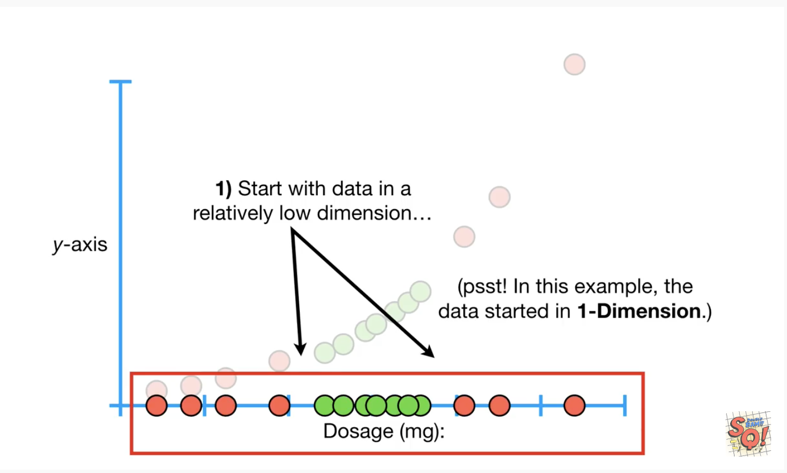
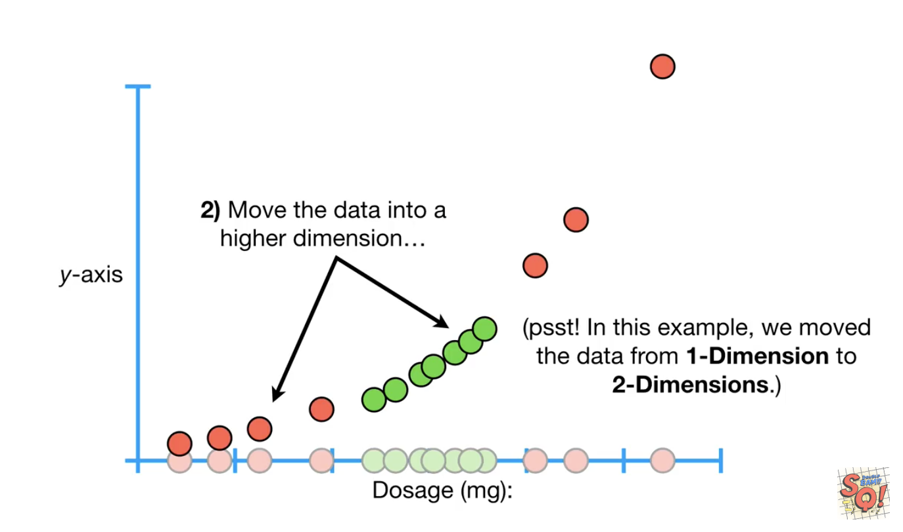
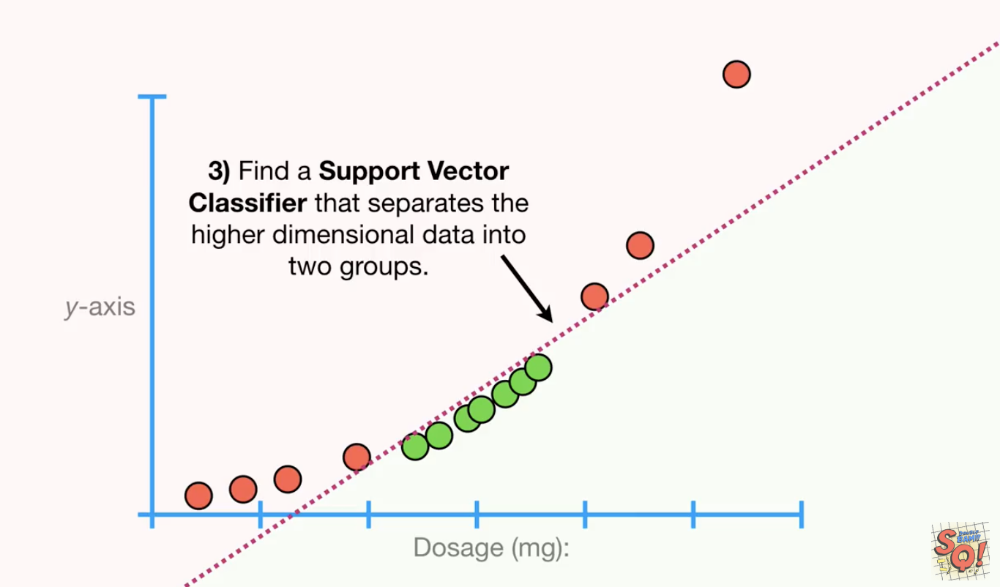
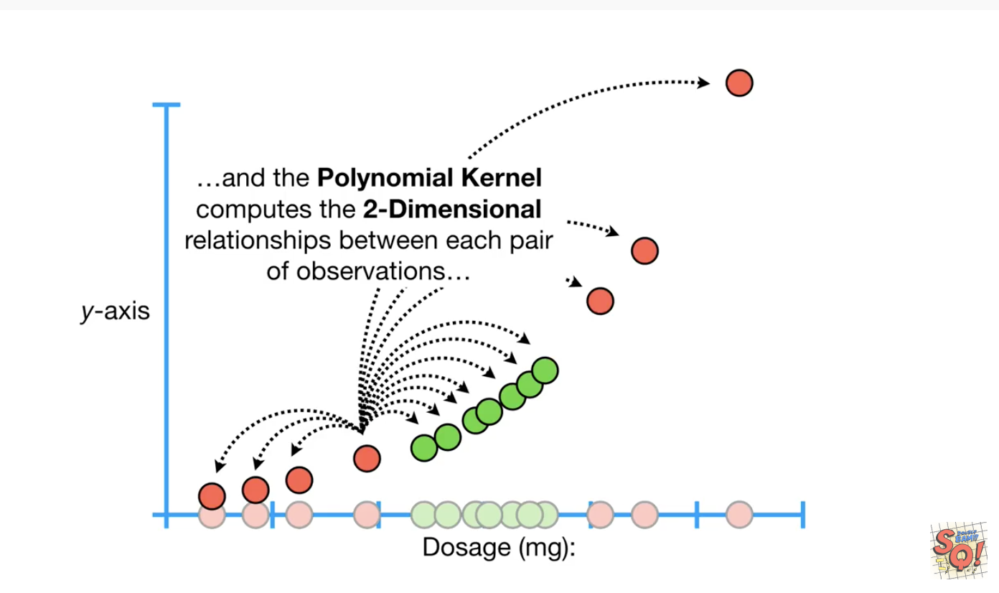
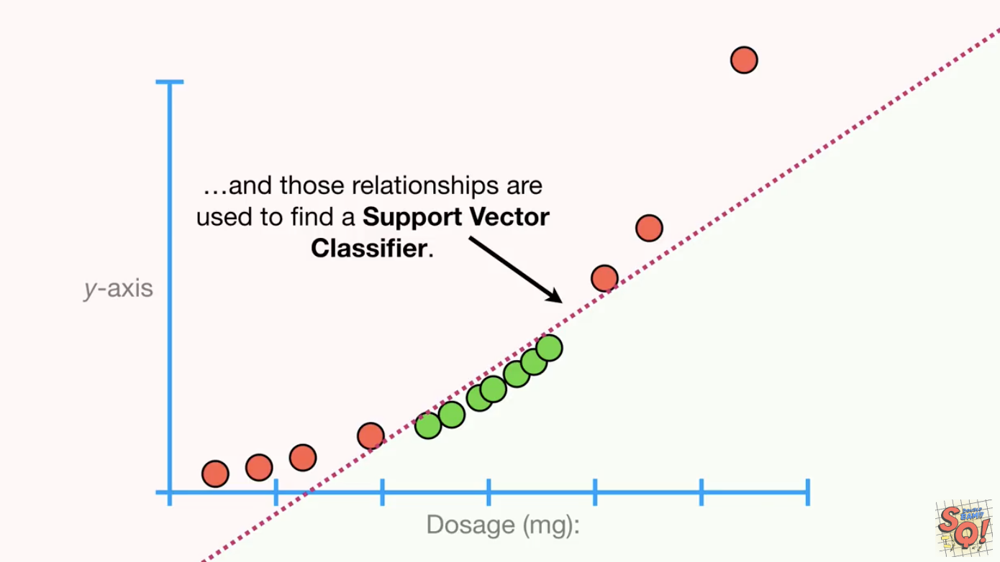
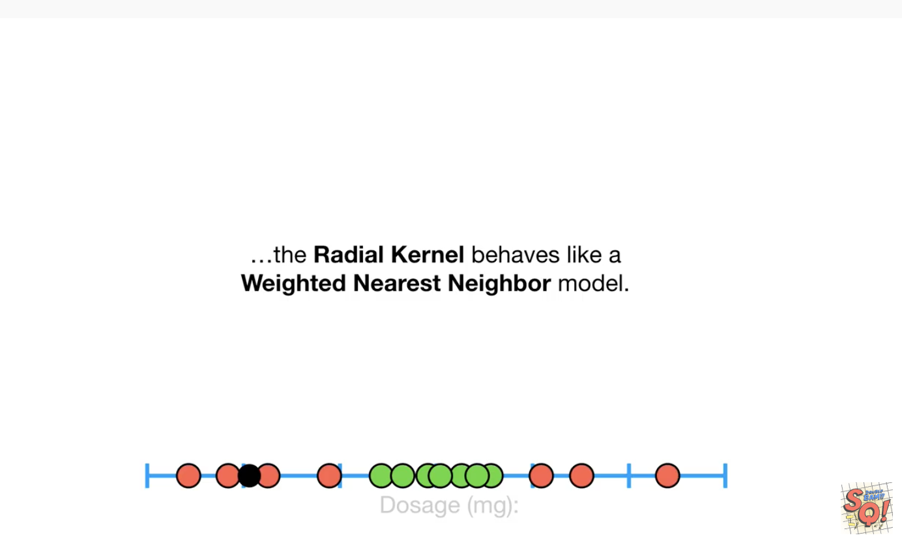
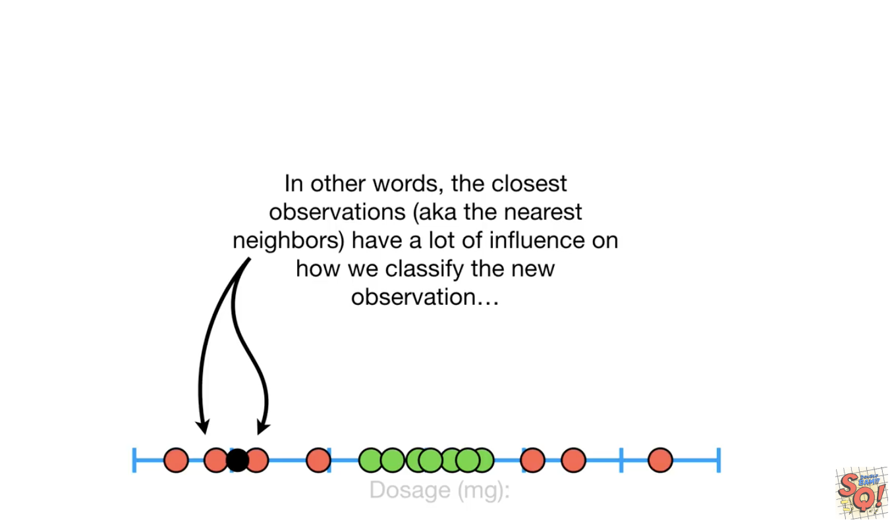
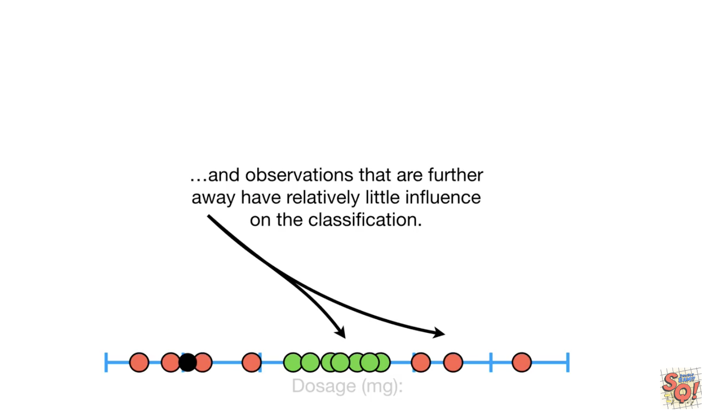
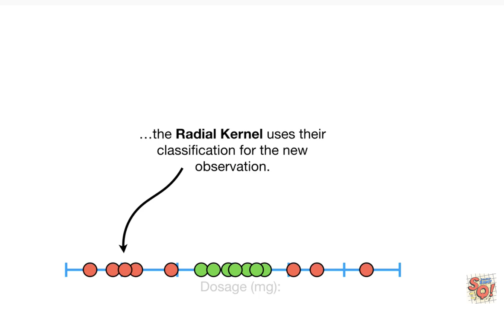

# Support Vector Machines #

## Notes from StatQuest [video](https://www.youtube.com/watch?v=efR1C6CvhmE) ##

### Definitions ###

- **Soft Margin**: Classifier boundary/threshold that allows for misclassification of observations/data points.
- **Cross Validation**: Allows for testing how many misclassifications result in better classification in the long run.
- **Support Vector Classifier (SVC)**: Observations on the edge and within the Soft Margin are called **Support Vectors**
  - When the data are _1-Dimensional_ the SVC is a single point on a 1-Dimensional number line.
  - When the data are _2-Dimensional_ the SVC is a line and the _Soft Margin_ is measured between those data points closest to it.
    - The SVC is a _1-Dimensional_ line in a _2-Dimensional_ space.
  - When the data are _3-Dimensional_ the SVC is a plane, instead of a line and classifications of new observations are determined by which side of the plane they're on.
    - The SVC is a _2-Dimensional_ plane in a _3-Dimensional_ space.
  - When the data are in 4 or more Dimensions, the SVC is a _hyperplane_.

### Support Vector Machines ###

When there're 2 categories, but no obvious linear classifier that separates them in a nice way, **Support Vector MAchines** work by moving the data into a relatively high dimensional space and finding a relatively high dimensional **Support Vector Classifier** that can effectively classify the observations.

**Support Vector Machines (SVM)**: Add dimensionality to observations such that a SVC can be applied to properly classify data that doesn't neatly segment itself in lower dimensions.

The main ideas behind Support Vector Machines:
|  |
| :-: |
|  |
|  |

**Kernel Functions** are used by SVMs to _systematically_ find **Support Vector Classifiers** in higher dimensions.
- **Polynomial Kernel** systematically increases dimensions by setting **_d_**, the degree of the polynomial and the relationships between each pair od observations are used to fina a **Support Vector Classifier**.
  - Polynomial Kernel has a parameter **d** which stands for **degree** of the polynomial.
  - When d = 1, the Polynomial Kernel computes the relationships between each pair of observations in _1-Dimension_ and these relationships are used to find a SVC.
  - When d = 2, the Polynomial Kernel computes the relationships between each pair of observations in _2-Dimensions_.
   
  
  |  |
  | :-: |
  |  |
  
   
  
  - A good value for **_d_** can be found using **Cross Validation**.
  
- **Radial Kernel AKA Radial Basis Function (RBF) Kernel** is also very commonly used.
  - Primarily used to find **Support Vector Classifiers** in _infinite dimensions_.
  - However, when classifying _1-Dimensional_ observations, it functions like a **Weighted Nearest Neighbor** model and associated the nearest observations to one classifier or the other:
   
  
  |  |
  | :-: |
  |  |
  |  |
  |  |
  
   
  
**Kernel Trick**: Because Kernel functions only calculate the relationships between every pair of points as _if_ they're in higher dimensions; they don't _actually_ do the transformations, it's called a **trick** 

- This trick reduces the computation required for **Support Vector Machines** by avoiding the math that transforms the data from low to high dimensions and it makes calculating relationships in the infinite dimensions used by the **Radial Kernel** possible.